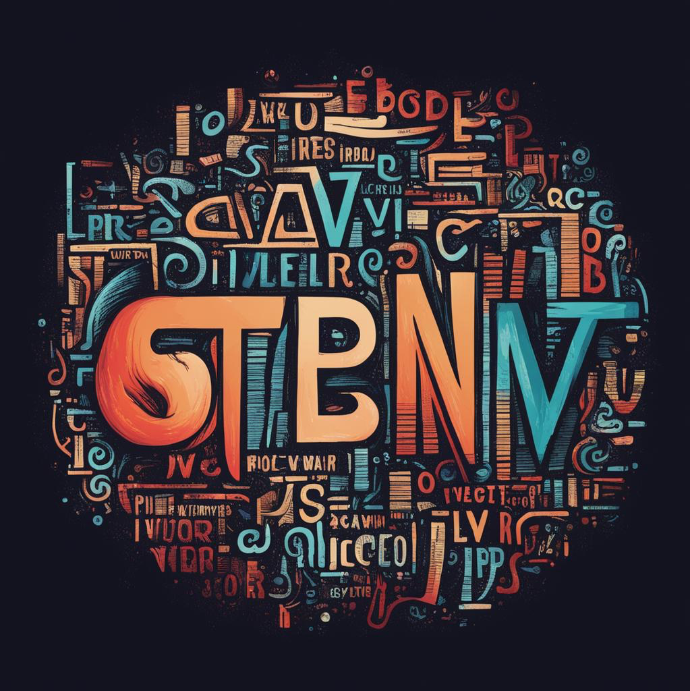

<p align="center">
  
  <h3 align="center">word2vec</h3>
  <p align="center"><strong>Golang "native" implementation of word2vec algorithm (word2vec++ port)</strong></p>

  <p align="center">
    <!-- Version -->
    <a href="https://github.com/fogfish/word2vec/releases">
      
    </a>
    <!-- Documentation -->
    <a href="https://pkg.go.dev/github.com/fogfish/word2vec">
      
    </a>
    <!-- Build Status
    <a href="https://github.com/fogfish/word2vec/actions/">
      
    </a>
    -->
    <!-- GitHub -->
    <a href="http://github.com/fogfish/word2vec">
      
    </a>
    <!-- Coverage
    <a href="https://coveralls.io/github/fogfish/word2vec?branch=main">
      
    </a>
    -->
    <!-- Go Card -->
    <a href="https://goreportcard.com/report/github.com/fogfish/word2vec">
      
    </a>
  </p>
</p>

--- 

The library implements the [word2vec](https://en.wikipedia.org/wiki/Word2vec) algorithm for Golang, leveraging the native runtime without relying on external servers or Python dependencies. This Golang module uses a CGO bridge to integrate Max Fomichev's [word2vec C++ library](https://github.com/maxoodf/word2vec).


## Inspirations

Despite the availability of commercial and open-source LLMs, word2vec and its derivatives remain prevalent in building niche applications, particularly when dealing with private datasets. Python, along with the `gensim` library, is widely adopted as the quickest means to explore the model for production-grade workloads. Gensim is optimized for performance through the use of C, BLAS, and memory-mapping. However, if your application demands even greater speed, such as performing 94K embeddings calculations per second on a single core, native development becomes the optimal solution.

Our objective is to provide a solution that allows the execution of the Word2Vec model natively within a Golang application, eliminating the need to wrap `gensim` as a sidecar.

Evaluating existing Golang implementations led us to the promising options. However, performance constraints on the UMBC corpus sparked a pursuit of native C integration. We birthed this library after Max Fomichev's [C++ implementation](https://github.com/maxoodf/word2vec) as prominent cross platform solution.

Read more in the blog post [Blazing Fast Text Embedding With Word2Vec in Golang to Power Extensibility of Large Language Models (LLMs)](https://medium.com/@dmkolesnikov/blazing-fast-text-embedding-calculation-with-word2vec-in-golang-to-power-extensibility-of-large-ed05625dea62)


## Getting started

- [Inspirations](#inspirations)
- [Getting started](#getting-started)
  - [Pre-requisites](#pre-requisites)
- [Usage Command line utility](#usage-command-line-utility)
  - [Training](#training)
  - [Embeddings](#embeddings)
  - [Lookup nearest](#lookup-nearest)
- [Usage Golang module](#usage-golang-module)
  - [Embeddings](#embeddings-1)
  - [Lookup nearest](#lookup-nearest-1)
- [How To Contribute](#how-to-contribute)
  - [commit message](#commit-message)
  - [bugs](#bugs)
- [License](#license)
- [References](#references)


The project offers a solution as both a Golang module and a simple command-line application. Use the command-line tool to train word2vec models and the Golang module to compute embeddings and find similar words within your application. 

### Pre-requisites

A dynamically linked library is required for the CGO bridge to integrate with Max Fomichev's word2vec C++ library. Ensure that the necessary C++ libraries are installed and properly configured on your system to use this functionality.

To build the required dynamically linked library, use a C++11 compatible compiler and CMake 3.1 or higher. This step is essential before proceeding with the installation and usage of the Golang module.

```bash
mkdir _build && cd _build
brew install cmake
cmake -DCMAKE_BUILD_TYPE=Release ../libw2v
make
cp ../libw2v/lib/libw2v.dylib /usr/local/lib/libw2v.dylib
```

**Note**: The project does not currently distribute library binaries, though this feature is planned for a future version. You will need to build the binaries yourself for your target runtime. If you need assistance, please [raise an issue](https://github.com/fogfish/word2vec/issues).


## Usage Command line utility

You can install application from source code but it requires [Golang](https://go.dev/) to be installed.

```bash
go install github.com/fogfish/word2vec/w2v@latest
```

### Training

The library uses memory-mapped files, enabling extremely fast sequential reading and writing. However, this approach means that the model file format is not compatible with other libraries. Therefore,it is absolutely necessary to train the model using this library if you plan to utilize its functionality.

To start training, begin by configuring the model with the desired parameters: 

```bash
w2v train config > config.yaml
```

The default arguments provide satisfactory results for most text corpora:
* word vector dimension 300
* context window 5 words
* 5 training epoch with 0.05 learning rate
* skip-gram architecture
* negative sampling 5

See the article [Word2Vec: Optimal hyperparameters and their impact on natural language processing downstream tasks](https://www.degruyter.com/document/doi/10.1515/comp-2022-0236/html?lang=en) for consideration about training options.

The repository contains the book ["War and Peace"](./doc/leo-tolstoy-war-and-peace-en.txt) by Leo Tolstoy. We have also used [stop words](https://github.com/stopwords-iso/stopwords-en) to increase accuracy.

```bash
w2v train -C config.yaml \
  -o wap-v300_w5_e5_s1_h005-en.bin \
  -f ../doc/leo-tolstoy-war-and-peace-en.txt
```

We recommend naming the output model based on the parameters used during training. Use the following format for naming:
* `v` for vector size
* `w` for context window size
* `e` for number of training epochs
* `s1` for skip-gram architecture or `s0` for CBOW
* `h1` for hierarchical softmax or `h0` for negative sampling following with size digits
For example, a model trained with a vector size of 300, a context window of 5, 10 epochs, using the skip-gram architecture and negative sampling could be named `v300_w5_e10_s1_h1.bin`.


### Embeddings

Calculate embeddings for either a single word or a bag of words. Create a file where each line contains either a single word or a paragraph. The utility will then output a text document where each line contains the corresponding vector for the given text.

```bash
echo "
alexander
emperor
king
tsar
the emperor alexander
" > bow.txt
```

```bash
w2v embedding \
  -m wap-v300_w5_e5_s1_h005-en.bin \
  bow.txt
```

### Lookup nearest

The word2vec model allows users to find words that are most similar to a given word based on their vector representations. By calculating the similarity between word vectors, the model identifies and retrieves words that are closest in meaning or context to the input word. 

```bash
w2v lookup \
  -m wap-v300_w5_e5_s1_h005-en.bin \
  -k 10 \
  alexander
```

## Usage Golang module

The latest version of the module is available at `main` branch. All development, including new features and bug fixes, take place on the `main` branch using forking and pull requests as described in contribution guidelines. The stable version is available via Golang modules.

Use `go get` to retrieve the library and add it as dependency to your application.

```bash
go get -u github.com/fogfish/word2vec
```

### Embeddings

Calculate embeddings for either a single word or a bag of words.

```go
import "github.com/fogfish/word2vec"

// 1. Load model
w2v, err := word2vec.Load("wap-v300_w5_e5_s1_h005-en.bin", 300)

// 2. Allocated the memory for vector
vec := make([]float32, 300)

// 3. Calculate embeddings for the document
doc := "the emperor alexander"
err = w2v.Embedding(doc, vec)
```

See [the example](./cmd/opts/embedding.go) or try it our via command line


### Lookup nearest

Find words that are most similar to a given word based on their vector representations.

```go
import "github.com/fogfish/word2vec"

// 1. Load model
w2v, err := word2vec.Load("wap-v300_w5_e5_s1_h005-en.bin", 300)

seq := make([]word2vec.Nearest, 30)
w2v.Lookup("alexander", seq)
```

See [the example](./cmd/opts/lookup.go)


## How To Contribute

The library is [MIT](LICENSE) licensed and accepts contributions via GitHub pull requests:

1. Fork it
2. Create your feature branch (`git checkout -b my-new-feature`)
3. Commit your changes (`git commit -am 'Added some feature'`)
4. Push to the branch (`git push origin my-new-feature`)
5. Create new Pull Request

The build and testing process requires [Go](https://golang.org) version 1.21 or later.


### commit message

The commit message helps us to write a good release note, speed-up review process. The message should address two question what changed and why. The project follows the template defined by chapter [Contributing to a Project](http://git-scm.com/book/ch5-2.html) of Git book.

### bugs

If you experience any issues with the library, please let us know via [GitHub issues](https://github.com/fogfish/word2vec/issue). We appreciate detailed and accurate reports that help us to identity and replicate the issue. 


## License

[](LICENSE)


## References

1. [Go Wiki: cgo](https://go.dev/wiki/cgo)
2. [Calling C code with cgo](https://spatocode.com/blog/calling-c-code-with-cgo)
3. [Pass struct and array of structs to C function from Go](https://stackoverflow.com/questions/19910647/pass-struct-and-array-of-structs-to-c-function-from-go)
4. [cgo - cast C struct to Go struct](https://groups.google.com/g/golang-nuts/c/JkvR4dQy9t4)
5. [Word2Vec (google code)](https://code.google.com/archive/p/word2vec/)
6. [word2vec patch for Mac OS X](https://github.com/William-Yeh/word2vec-mac)